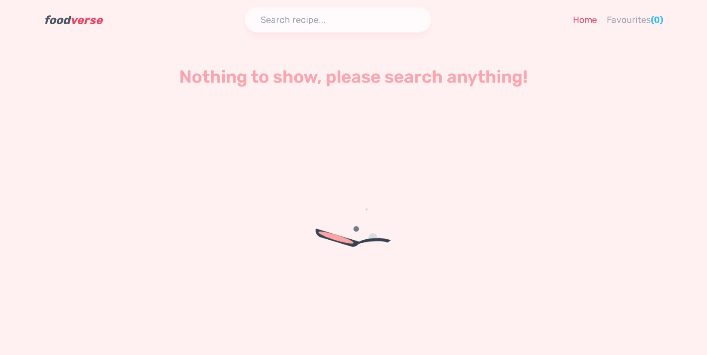
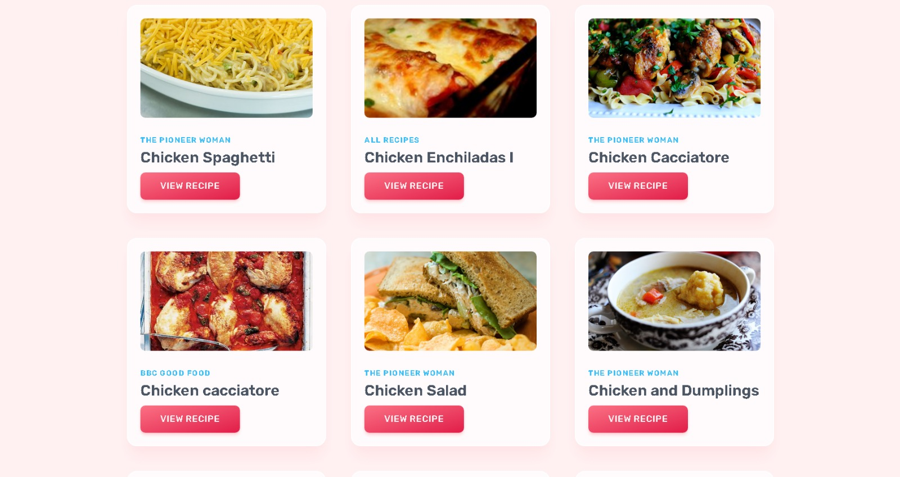
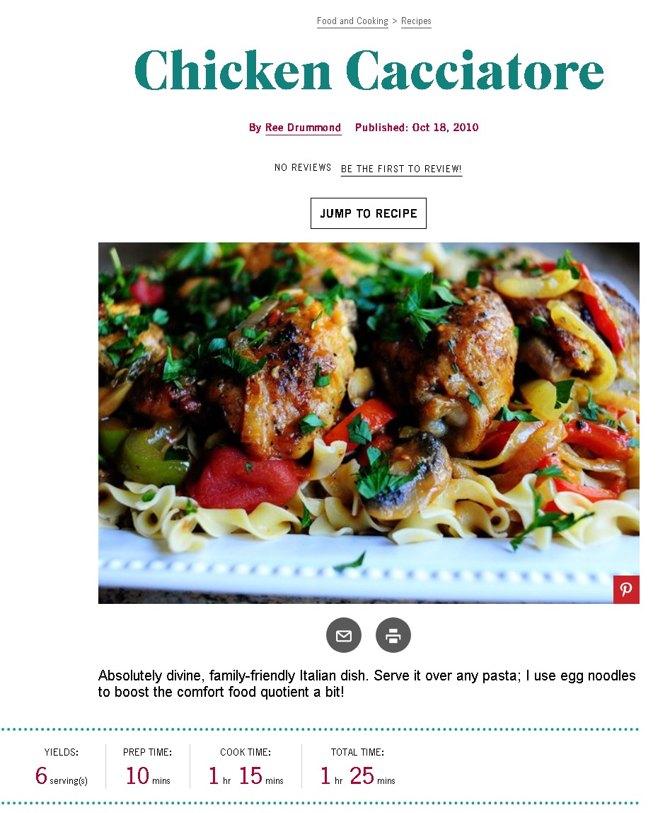

# ChefVerse

ChefVerse is the React based website build for Cooks and Homemakers to contribute and review about Multiple cuisines and Recipes across the world .

## Badges

Add badges from somewhere like: [shields.io](https://shields.io/)

## Authors

- [@tacticalyash ](https://www.github.com/tacticalyash)

## Features

- Light/dark mode toggle
- Mutliple Cuisines
- Fullscreen mode
- Tied up with Nearby restarestaurants 
- Street maps
- Fitness facilities and diet plans
- Feedback section

## Screenshots
### Homepage

### Searching UI

### Review 

### Info UI

more screenshots available soon..

## Documentation

[Documentation](https://linktodocumentation)

## FAQ

#### Is it provides most significant Multiple Cuisnes? 

Well we had added Most of the unique Recipies and 

#### Does doctor and patients can make live convo and one to one meet?

It suppose to be possible if we get the approval and licenses from respective hospitals.And the main route is we have to build connection across the country which it will acceptable by rule.

## feel free to ask question here siciliancpp@gmail.com

## Color Reference

| Color             | Hex                                                                |
| ----------------- | ------------------------------------------------------------------ |
| Example black |  #0a192f |
| Example NULL |  #f8f8f8 |
| Example Cyan |  #00b48a |
| Example green |  #00d1a0 |

## Feedback

If you have any feedback, please reach out to us at chetansanap0900@gmail.com && instagram :- @chetu_sanap24

